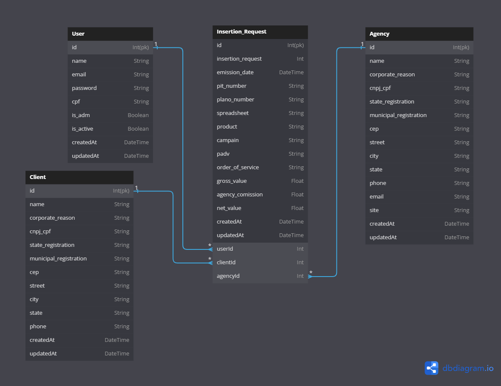

<h1 align ='center'> <strong>API OPEC Authomation<strong> </h1>

## **Content Table**

- [**Content Table**](#content-table)
- [**1. Overview**](#1-overview)
- [**2. Entity Relationship Diagram**](#2-entity-relationship-diagram)

 

---

## **1. Overview**

Opec management API (operational and commercial department) for radio and TV stations, for managing Advertising Insertion Requests and Billing Control with Graphics and Reporting resources.

 

---

## **2. Entity Relationship Diagram**

[ Back to the top ](#content-table)

 

